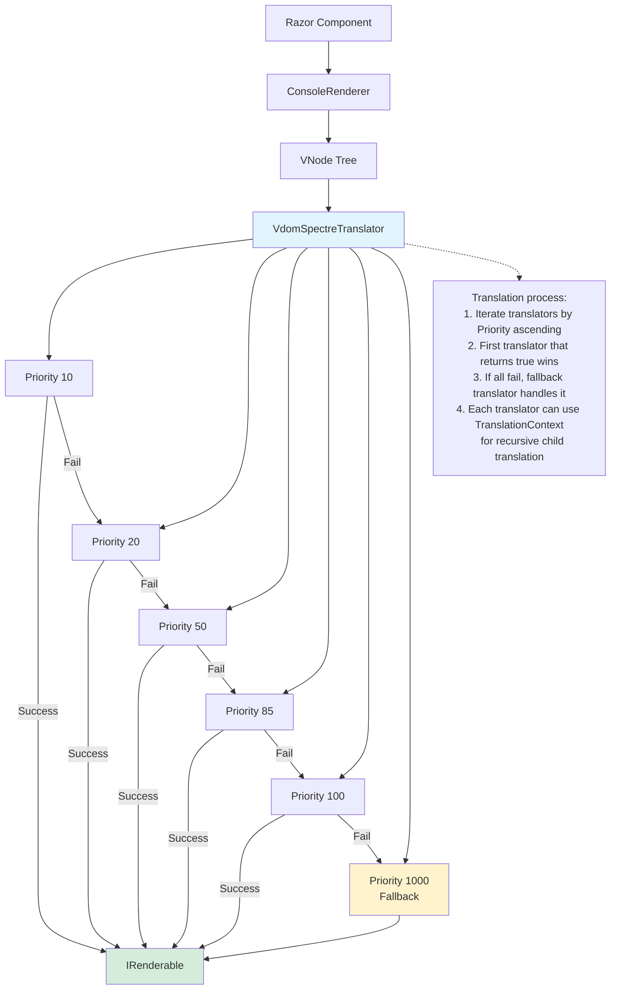

# Custom VDOM Translators

## Overview

RazorConsole uses a Virtual DOM (VDOM) to translate Razor components into Spectre.Console renderables. The translation process is powered by **translators** - pluggable components that convert VDOM nodes into specific Spectre.Console visual elements. This document explains the translator architecture and how to extend RazorConsole with custom translators.

## Architecture

### Core Components

#### IVdomElementTranslator

The `IVdomElementTranslator` interface defines the contract for translating VDOM nodes to Spectre.Console renderables:

```csharp
public interface IVdomElementTranslator
{
    /// <summary>
    /// Gets the priority of this translator. Lower values are processed first.
    /// </summary>
    int Priority { get; }

    /// <summary>
    /// Attempts to translate a VNode to an IRenderable.
    /// </summary>
    bool TryTranslate(VNode node, TranslationContext context, out IRenderable? renderable);
}
```

**Key aspects:**
- **Priority**: Determines the order in which translators are tried. Lower values = higher priority (processed first).
- **TryTranslate**: Returns `true` and sets `renderable` if the translator can handle the node; otherwise returns `false`.

#### TranslationContext

Provides access to recursive translation for child nodes:

```csharp
public sealed class TranslationContext
{
    /// <summary>
    /// Attempts to translate a VNode to an IRenderable.
    /// </summary>
    public bool TryTranslate(VNode node, out IRenderable? renderable);
}
```

Use `context.TryTranslate()` to recursively translate child nodes within your custom translator.

#### VdomSpectreTranslator

The main orchestrator that:
1. Accepts a prioritized list of translators via dependency injection
2. Iterates through translators in priority order
3. Returns the first successful translation
4. Provides utility methods for common translation tasks

### Translation Pipeline



## Built-in Translators

RazorConsole includes 20 built-in translators with priorities from 10 to 1000:

| Priority | Translator | Handles | Spectre Type |
|----------|------------|---------|--------------|
| 10 | TextElementTranslator | `<span data-text="true">` | Markup |
| 20 | HtmlInlineTextElementTranslator | `<strong>`, `<em>`, `<code>` | Markup |
| 30 | ParagraphElementTranslator | `<p>` | Markup |
| 40 | SpacerElementTranslator | `<div data-spacer="true">` | Padder |
| 50 | NewlineElementTranslator | `<br>` | Text |
| 60 | SpinnerElementTranslator | `<div class="spinner">` | Spinner |
| 70-80 | Button translators | `<button>` | Button renderables |
| 90 | SyntaxHighlighterElementTranslator | `<div class="syntax-highlighter">` | SyntaxRenderable |
| 100-190 | Layout translators | Panels, rows, columns, grids, padding, alignment | Layout renderables |
| 1000 | FailToRenderElementTranslator | Fallback for unhandled nodes | Diagnostic markup |

## Creating Custom Translators

### Step 1: Implement IVdomElementTranslator

Create a class that implements the interface:

```csharp
using RazorConsole.Core.Rendering.Vdom;
using RazorConsole.Core.Vdom;
using Spectre.Console;
using Spectre.Console.Rendering;

public sealed class OverflowElementTranslator : IVdomElementTranslator
{
    // Define priority (1-1000+). Lower = higher priority.
    // Use 1-9 to run before all built-ins
    // Use 10-190 to interleave with specific built-ins
    // Use 200-999 to run after most built-ins but before fallback
    // Use 1000+ to run after all built-ins
    public int Priority => 85;

    public bool TryTranslate(VNode node, TranslationContext context, out IRenderable? renderable)
    {
        renderable = null;

        // 1. Check if this node is what we handle
        if (node.Kind != VNodeKind.Element)
        {
            return false; // Not an element, skip
        }

        if (!string.Equals(node.TagName, "div", StringComparison.OrdinalIgnoreCase))
        {
            return false; // Not a div, skip
        }

        // Check for our custom attribute
        if (!node.Attributes.TryGetValue("data-overflow", out var overflowType))
        {
            return false; // No overflow attribute, skip
        }

        // 2. Extract configuration from attributes
        var width = VdomSpectreTranslator.TryParsePositiveInt(
            VdomSpectreTranslator.GetAttribute(node, "data-width"), 
            out var w) ? w : 80;

        // 3. Translate child nodes
        if (!VdomSpectreTranslator.TryConvertChildrenToRenderables(
            node.Children, context, out var children))
        {
            return false; // Children couldn't be translated
        }

        var content = VdomSpectreTranslator.ComposeChildContent(children);

        // 4. Create the Spectre.Console renderable
        renderable = overflowType?.ToLowerInvariant() switch
        {
            "ellipsis" => new Padder(content).Overflow(Overflow.Ellipsis),
            "crop" => new Padder(content).Overflow(Overflow.Crop),
            "fold" => new Padder(content).Overflow(Overflow.Fold),
            _ => content
        };

        return true; // Successfully translated
    }
}
```

### Step 2: Register the Translator

Register your custom translator in your application's service configuration:

```csharp
using Microsoft.Extensions.Hosting;
using RazorConsole.Core;
using RazorConsole.Core.Vdom;

IHostBuilder hostBuilder = Host.CreateDefaultBuilder(args)
    .UseRazorConsole<MyComponent>(configure: config => 
        {
            config.ConfigureServices(services =>
            {
                // Register by type (translator will be instantiated via DI)
                services.AddVdomTranslator<OverflowElementTranslator>();
                
                // Or register by instance
                services.AddVdomTranslator(new OverflowElementTranslator());
                
                // Or register with factory (useful for DI dependencies)
                services.AddVdomTranslator(sp => 
                    new OverflowElementTranslator(/* inject services here */));  
            });
        }
    );

IHost host = hostBuilder.Build();
await host.RunAsync();
```

### Step 3: Use in Razor Components

Create Razor components that emit the VDOM structure your translator expects:

```razor
@namespace MyApp.Components

<div data-overflow="ellipsis" data-width="40">
    This is a very long line of text that will be truncated with an ellipsis 
    when it exceeds the specified width of 40 characters.
</div>

<div data-overflow="fold">
    <Markup Content="This text will fold/wrap when it's too long
            for the available space in the console window."
    />
</div>
```

## Utility Methods

`VdomSpectreTranslator` provides static utility methods to simplify translator implementation:

### Node Inspection

```csharp
// Get attribute value
string? value = VdomSpectreTranslator.GetAttribute(node, "data-style");

// Check for CSS class
bool hasClass = VdomSpectreTranslator.HasClass(node, "my-class");

// Collect all inner text recursively
string? text = VdomSpectreTranslator.CollectInnerText(node);
```

### Attribute Parsing

```csharp
// Parse boolean attribute
if (VdomSpectreTranslator.TryGetBoolAttribute(node, "data-enabled", out bool enabled))
{
    // Use enabled value
}

// Parse integer with fallback
int count = VdomSpectreTranslator.TryGetIntAttribute(node, "data-count", fallback: 10);

// Parse positive integer
if (VdomSpectreTranslator.TryParsePositiveInt(rawValue, out int result))
{
    // Use result
}

// Parse positive double
if (VdomSpectreTranslator.TryParsePositiveDouble(rawValue, out double result))
{
    // Use result
}

// Parse optional positive integer (returns null if invalid)
int? maybeWidth = VdomSpectreTranslator.ParseOptionalPositiveInt(rawValue);

// Parse padding (CSS-style: "1", "1,2", "1,2,3", or "1,2,3,4")
if (VdomSpectreTranslator.TryParsePadding(rawValue, out Padding padding))
{
    // Use padding
}
```

### Layout Parsing

```csharp
// Parse horizontal alignment
var hAlign = VdomSpectreTranslator.ParseHorizontalAlignment(value); 
// Returns: Left, Center, or Right

// Parse vertical alignment
var vAlign = VdomSpectreTranslator.ParseVerticalAlignment(value);
// Returns: Top, Middle, or Bottom
```

### Child Translation

```csharp
// Translate child nodes to renderables
if (VdomSpectreTranslator.TryConvertChildrenToRenderables(
    node.Children, context, out List<IRenderable> renderables))
{
    // Success - use renderables list
}

// Compose multiple renderables into one
IRenderable composed = VdomSpectreTranslator.ComposeChildContent(renderables);
// Returns single item as-is, multiple items as Rows, empty as empty Markup
```

## Best Practices

### 1. Priority Selection

Choose priorities strategically:

- **1-9**: Ultra-high priority for overriding built-in behavior
- **10-190**: Interleave with specific built-in translators
  - Use priority just below a built-in to handle more specific cases
  - Use priority just above a built-in to intercept before it
- **200-999**: General custom translators
- **1000+**: Fallback handlers that run after all built-ins

### 2. Fail Fast

Return `false` immediately if the node doesn't match your criteria:

```csharp
// Good: Early returns
if (node.Kind != VNodeKind.Element) return false;
if (node.TagName != "div") return false;
if (!node.Attributes.ContainsKey("data-custom")) return false;

// Bad: Nested conditions
if (node.Kind == VNodeKind.Element)
{
    if (node.TagName == "div")
    {
        if (node.Attributes.ContainsKey("data-custom"))
        {
            // Logic here
        }
    }
}
```

### 3. Use String Comparison Carefully

VDOM attributes and tag names use case-insensitive comparison:

```csharp
// Good: Case-insensitive
if (string.Equals(node.TagName, "div", StringComparison.OrdinalIgnoreCase))

// Bad: Case-sensitive (may miss valid matches)
if (node.TagName == "div")
```

### 4. Handle Children Properly

Always use `TryConvertChildrenToRenderables` for recursive translation:

```csharp
// Good: Recursive translation via context
if (!VdomSpectreTranslator.TryConvertChildrenToRenderables(
    node.Children, context, out var children))
{
    return false; // Failed to translate children
}

// Bad: Accessing raw children (loses translation)
var rawChildren = node.Children; // VNode children, not renderables!
```

### 5. Validate Configuration

Validate attributes before use and provide sensible defaults:

```csharp
// Good: Validation with defaults
var width = VdomSpectreTranslator.TryParsePositiveInt(
    VdomSpectreTranslator.GetAttribute(node, "data-width"),
    out var w) ? w : 80; // Default to 80 if invalid or missing

// Bad: Assuming valid input
var width = int.Parse(node.Attributes["data-width"]); // May throw!
```

### 6. Immutability

Create new renderable instances; don't mutate existing ones:

```csharp
// Good: Create new instances
var panel = new Panel(content)
    .Expand()
    .BorderColor(Color.Blue);

// Bad: Reusing renderables
var shared = new Panel(content);
shared.Expand(); // Modifies shared state
```

### 7. Thread Safety

Translators should be stateless or use immutable state:

```csharp
// Good: Stateless translator
public sealed class MyTranslator : IVdomElementTranslator
{
    public int Priority => 100;
    
    public bool TryTranslate(VNode node, TranslationContext context, 
        out IRenderable? renderable)
    {
        // No instance fields modified
    }
}

// Bad: Mutable state
private int _counter; // Shared across translations - NOT thread-safe!
```

## Advanced Scenarios

### Using Dependency Injection

Translators can receive dependencies via constructor injection:

```csharp
public sealed class DatabaseStyleTranslator : IVdomElementTranslator
{
    private readonly IStyleProvider _styleProvider;
    
    public DatabaseStyleTranslator(IStyleProvider styleProvider)
    {
        _styleProvider = styleProvider ?? throw new ArgumentNullException(nameof(styleProvider));
    }
    
    public int Priority => 95;
    
    public bool TryTranslate(VNode node, TranslationContext context, out IRenderable? renderable)
    {
        renderable = null;
        
        if (!node.Attributes.TryGetValue("data-style-id", out var styleId))
        {
            return false;
        }
        
        // Fetch style from database via injected service
        var style = _styleProvider.GetStyle(styleId);
        
        // Create renderable with style
        // ...
        
        return true;
    }
}

// Registration
services.AddSingleton<IStyleProvider, MyStyleProvider>();
services.AddVdomTranslator<DatabaseStyleTranslator>();
```

### Conditional Translation

Handle multiple scenarios within one translator:

```csharp
public sealed class AlertTranslator : IVdomElementTranslator
{
    public int Priority => 105;
    
    public bool TryTranslate(VNode node, TranslationContext context, out IRenderable? renderable)
    {
        renderable = null;
        
        if (!VdomSpectreTranslator.HasClass(node, "alert"))
        {
            return false;
        }
        
        // Translate children once
        if (!VdomSpectreTranslator.TryConvertChildrenToRenderables(
            node.Children, context, out var children))
        {
            return false;
        }
        
        var content = VdomSpectreTranslator.ComposeChildContent(children);
        
        // Different styles based on alert type
        if (VdomSpectreTranslator.HasClass(node, "alert-danger"))
        {
            renderable = new Panel(content)
                .BorderColor(Color.Red)
                .Header("[red]⚠ Error[/]");
        }
        else if (VdomSpectreTranslator.HasClass(node, "alert-success"))
        {
            renderable = new Panel(content)
                .BorderColor(Color.Green)
                .Header("[green]✓ Success[/]");
        }
        else if (VdomSpectreTranslator.HasClass(node, "alert-warning"))
        {
            renderable = new Panel(content)
                .BorderColor(Color.Yellow)
                .Header("[yellow]⚡ Warning[/]");
        }
        else
        {
            // Default alert style
            renderable = new Panel(content)
                .BorderColor(Color.Blue)
                .Header("[blue]ℹ Info[/]");
        }
        
        return true;
    }
}
```

### Composing Complex Renderables

Build sophisticated layouts:

```csharp
public sealed class CardTranslator : IVdomElementTranslator
{
    public int Priority => 110;
    
    public bool TryTranslate(VNode node, TranslationContext context, out IRenderable? renderable)
    {
        renderable = null;
        
        if (!VdomSpectreTranslator.HasClass(node, "card"))
        {
            return false;
        }
        
        // Find specific child sections
        var headerNode = node.Children.FirstOrDefault(c => 
            VdomSpectreTranslator.HasClass(c, "card-header"));
        var bodyNode = node.Children.FirstOrDefault(c => 
            VdomSpectreTranslator.HasClass(c, "card-body"));
        var footerNode = node.Children.FirstOrDefault(c => 
            VdomSpectreTranslator.HasClass(c, "card-footer"));
        
        var parts = new List<IRenderable>();
        
        // Translate each section
        if (headerNode != null && context.TryTranslate(headerNode, out var header))
        {
            parts.Add(header);
            parts.Add(new Rule().RuleStyle(Style.Parse("grey")));
        }
        
        if (bodyNode != null && context.TryTranslate(bodyNode, out var body))
        {
            parts.Add(body);
        }
        
        if (footerNode != null && context.TryTranslate(footerNode, out var footer))
        {
            parts.Add(new Rule().RuleStyle(Style.Parse("grey")));
            parts.Add(footer);
        }
        
        if (parts.Count == 0)
        {
            return false;
        }
        
        // Wrap in panel
        renderable = new Panel(new Rows(parts))
            .BorderColor(Color.Grey);
        
        return true;
    }
}
```

## Troubleshooting

### Translator Not Being Called

**Problem**: Your translator's `TryTranslate` method is never invoked.

**Solutions**:
1. Verify the translator is registered: `services.AddVdomTranslator<MyTranslator>()`
2. Check priority - a higher-priority translator may be handling the node first
3. Ensure the VDOM structure matches your expectations (use debugger to inspect `node`)

### Translation Returns False

**Problem**: `TryTranslate` returns `false` when it should succeed.

**Solutions**:
1. Add logging to each conditional check to identify which fails
2. Verify attribute names match exactly (case-insensitive but must be spelled correctly)
3. Check that `node.Kind` is `VNodeKind.Element` for element nodes
4. Ensure child translation succeeds before trying to use children

### Wrong Renderable Displayed

**Problem**: Your translator succeeds but the wrong visual appears.

**Solutions**:
1. Verify another translator isn't handling the same node (check priorities)
2. Ensure you're setting `out renderable` to the correct Spectre type
3. Check that child translation is using `context.TryTranslate()` for recursion

### Priority Conflicts

**Problem**: Your translator runs at the wrong time relative to built-ins.

**Solutions**:
1. Review the built-in translator priority table above
2. Choose a priority just above or below the conflicting translator
3. Consider using 1-9 for overrides, 200-999 for new functionality

## Testing Custom Translators

### Unit Testing

Test translators in isolation:

```csharp
using Xunit;
using RazorConsole.Core.Rendering.Vdom;
using RazorConsole.Core.Vdom;

public class OverflowTranslatorTests
{
    [Fact]
    public void HandlesOverflowDiv()
    {
        // Arrange
        var translator = new OverflowElementTranslator();
        var node = VNode.CreateElement("div");
        node.SetAttribute("data-overflow", "ellipsis");
        node.AddChild(VNode.CreateText("Long text"));
        
        var mainTranslator = new VdomSpectreTranslator();
        var context = new TranslationContext(mainTranslator);
        
        // Act
        var success = translator.TryTranslate(node, context, out var renderable);
        
        // Assert
        Assert.True(success);
        Assert.NotNull(renderable);
    }
    
    [Fact]
    public void IgnoresNonOverflowDiv()
    {
        // Arrange
        var translator = new OverflowElementTranslator();
        var node = VNode.CreateElement("div");
        // No data-overflow attribute
        
        var mainTranslator = new VdomSpectreTranslator();
        var context = new TranslationContext(mainTranslator);
        
        // Act
        var success = translator.TryTranslate(node, context, out var renderable);
        
        // Assert
        Assert.False(success);
        Assert.Null(renderable);
    }
}
```

### Integration Testing

Test within the full RazorConsole pipeline:

```csharp
using Microsoft.Extensions.DependencyInjection;
using RazorConsole.Core;

[Fact]
public async Task OverflowTranslatorIntegration()
{
    // Arrange
    var app = AppHost.Create<TestComponent>(builder =>
    {
        builder.Services.AddVdomTranslator<OverflowElementTranslator>();
    });
    
    // Act
    var snapshot = await RenderComponentAsync<TestComponent>(app.Services);
    
    // Assert
    // Verify the rendered output contains expected overflow handling
    Assert.Contains("...", snapshot.ToString());
}
```

## Summary

The `IVdomElementTranslator` extensibility model provides a powerful way to extend RazorConsole with custom Spectre.Console renderables:

1. **Implement** `IVdomElementTranslator` with your custom logic
2. **Define** a priority to control when your translator runs
3. **Register** the translator using `AddVdomTranslator<T>()`
4. **Use** utility methods from `VdomSpectreTranslator` for common tasks
5. **Test** thoroughly with unit and integration tests

This architecture enables rich console UIs while maintaining clean separation between Razor components (structure) and Spectre.Console renderables (presentation).
