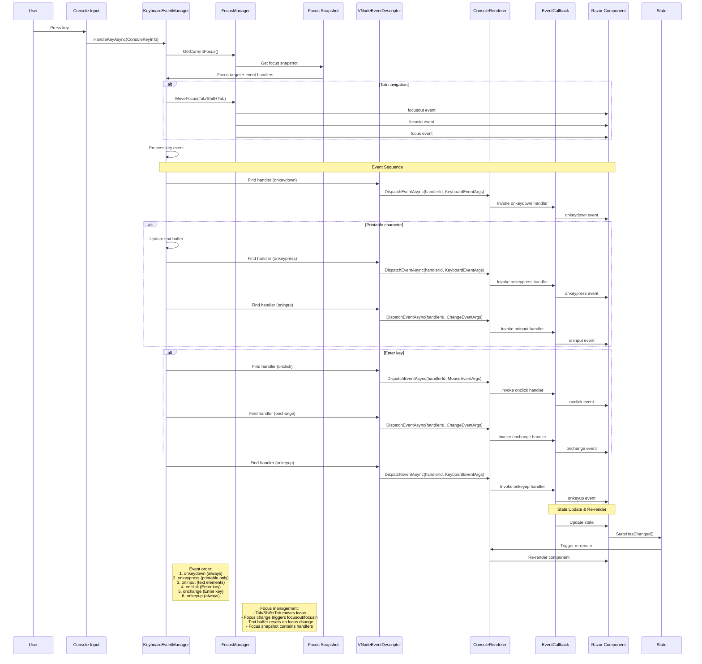
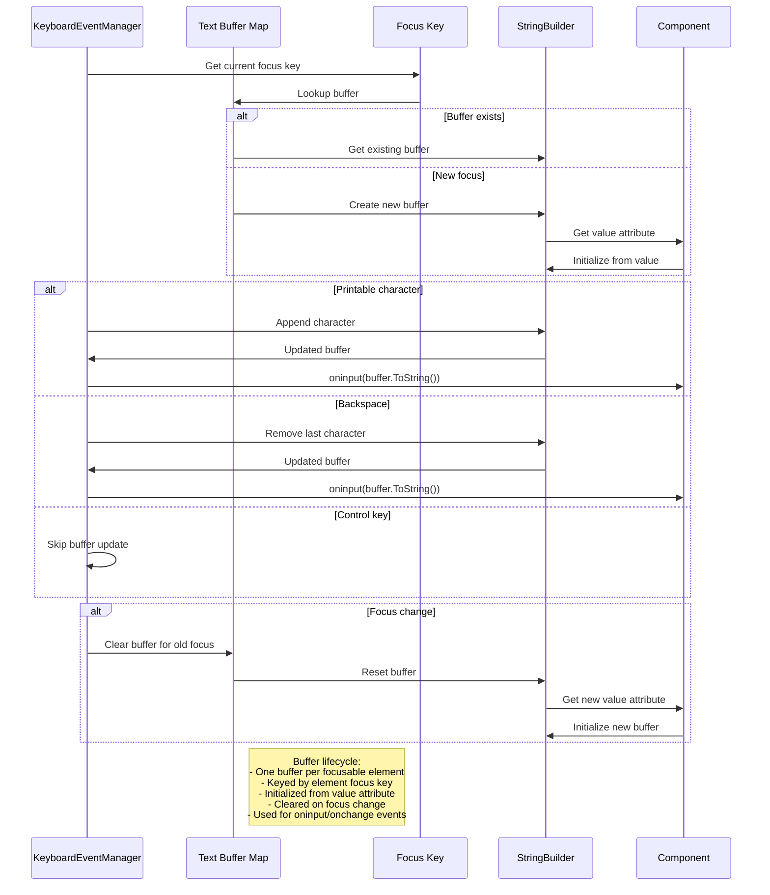

# Keyboard event specification

## Overview
RazorConsole surfaces console keyboard input to Razor components so you can respond to key presses just like you would in a browser. This guide outlines the event order, how focus influences dispatch, and what payloads to expect when wiring handlers such as `onkeydown`, `onkeypress`, `onkeyup`, and `oninput`.

## Keyboard Event Flow

## Text Buffer Management

## Supported events and dispatch order
Each keystroke can emit multiple events. When the focused element defines the corresponding handlers, they arrive in this order:

1. `onkeydown`
2. `onkeypress` *(printable characters only)*
3. `oninput` *(for elements managing text input)*
4. `onkeyup`

### What to expect
- `onkeydown` always fires first when a focus target is available.
- `onkeypress` is limited to characters where `ConsoleKeyInfo.KeyChar` is set (printable ASCII and similar keys).
- `oninput` appears immediately after the backing text buffer changes. See [Text input behaviour](#text-input-behaviour).
- `onkeyup` is the last event. If the new target does not define it, the manager retries with the element that initially held focus during the key cycle.

## Working with focus
Handlers run against the element that currently holds focus. Focus moves when you:

- Press `Tab` (or `Shift+Tab`) to traverse focusable elements.
- Call `FocusManager.FocusAsync` programmatically.
- Start a session that selects the first focusable element.

When focus changes, expect the usual `focusout`, `focusin`, and `focus` sequence before keyboard events resume. The element that lost focus has its buffered text cleared, and the newly focused element starts from its `value` attribute.

## Text input behaviour
RazorConsole keeps a per-element buffer to help with text fields:

- Printable characters append to the buffer.
- `Backspace` removes the last character when possible.
- Control keys (arrow keys, `Escape`, etc.) leave the buffer untouched.
- Buffers reset whenever focus leaves the element; returning to the element starts fresh from its `value` attribute.
- `oninput` receives a `ChangeEventArgs` whose `Value` mirrors the buffer.
- `Enter` reuses the same buffer value when raising `onchange`.

## Special key handling

### Tab navigation
- `Tab` advances focus to the next element.
- `Shift+Tab` moves focus to the previous element.
- Focus change events fire before keyboard events for the new element.

### Enter activation
- Triggers `onclick` (with `MouseEventArgs`) and then `onchange` if the element registers these handlers.
- Uses the current text buffer value for `onchange`.

### Other control keys
- Keys like `Escape`, arrow keys, and function keys dispatch `onkeydown` and `onkeyup` with normalized data.
- These keys never emit `oninput` or alter text buffers.

## Event payload quick reference

### `KeyboardEventArgs`
- `Type`: one of `keydown`, `keypress`, or `keyup`.
- `Key`: printable character or a semantic name such as `Enter`, `Tab`, `Backspace`.
- `Code`: best-effort physical code (`KeyA`, `Digit1`, or console key name fallback).
- Modifier flags: `AltKey`, `CtrlKey`, `ShiftKey` reflect console modifier state.
- `Repeat`: currently always `false`.

### `ChangeEventArgs`
- Sent for `oninput` and `onchange`.
- `Value`: latest text buffer contents.

### `MouseEventArgs`
- Only used for `onclick` during Enter activation.
- `Type = "click"`, `Button = 0`, `Detail = 1`.

## Usage tips
- Define `data-focusable="true"` or supply keyboard handlers to ensure elements participate in focus traversal.
- Combine `onkeydown` and `onkeyup` to track modifier state; use `onkeypress` for text entry when you need the character.
- Remember that `keypress` will not fire for keys such as arrows or function keys.

## Limitations and future work
- Holding down a key does not generate repeated `keydown` events.
- Keyboard events only target the focused element; global shortcuts are not yet supported.
- IME/composition scenarios rely entirely on `ConsoleKeyInfo` and may not provide full character coverage.
- `keypress` remains constrained to keys that expose `KeyChar` in the console environment.

## Advanced implementation notes
The remaining details help contributors reason about the underlying mechanics. Skip this section if you only consume the events.

### Dispatch pipeline
- `KeyboardEventManager` orchestrates the lifecycle, retrieving the focus snapshot from `FocusManager` and invoking handlers through the renderer dispatcher.
- Focus snapshots expose the focus `Key`, immutable attribute bag, and the list of registered `VNodeEvent` handlers used to route events.
- Handler names are resolved case-insensitively. Missing handlers simply skip dispatch; exceptions are logged and do not break the input loop.

### Text buffer storage
- Each focus key maps to a `StringBuilder` containing the buffered value.
- Buffers reset whenever their element loses focus so returning targets restart from the attribute-defined value.
- `Backspace` updates the buffer in place before events are dispatched.

### Related components
- `FocusManager` tracks focusable targets and raises `FocusChanged` notifications consumed by the keyboard manager.
- `RendererKeyboardEventDispatcher` bridges handler invocations to `ConsoleRenderer.DispatchEventAsync`.
- `ConsoleLiveDisplayContext` ensures focus changes trigger re-renders so UI reflects the current target.
