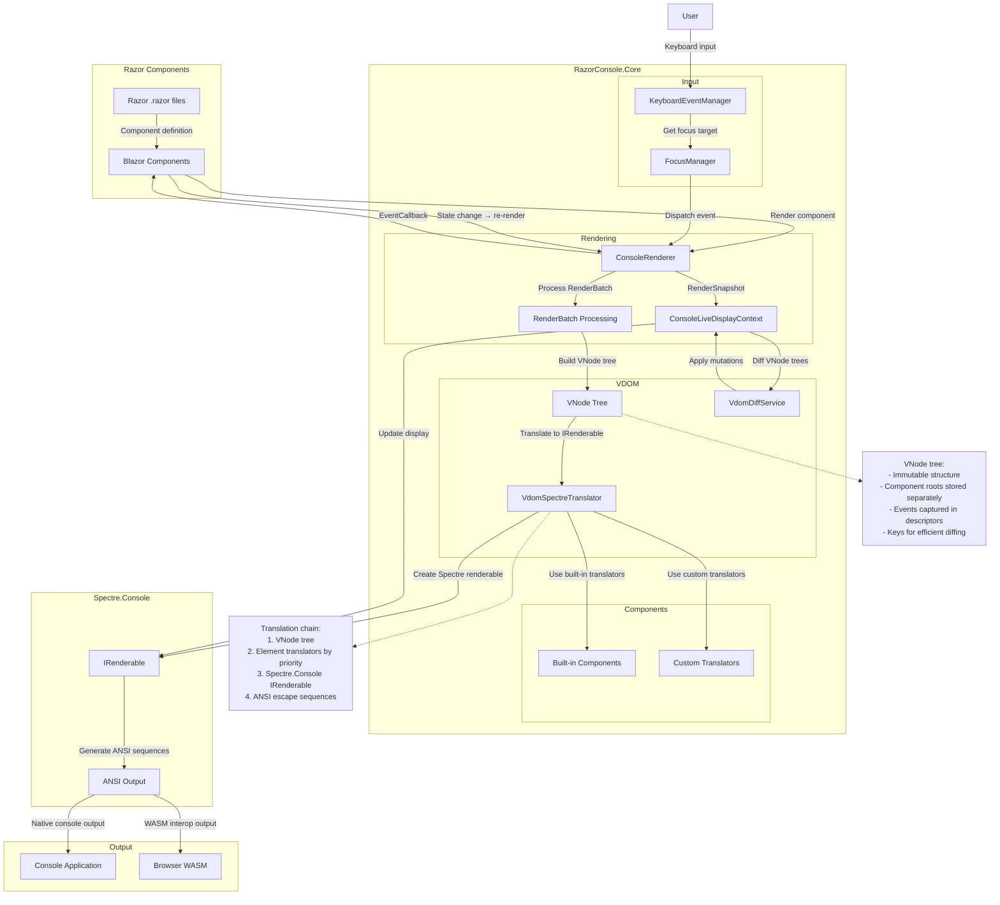

# RazorConsole Project Overview

## Architecture

## Project Structure

The project should contains the following files structure:

.github/
  workflows/ - CI/CD workflows
design-doc/
  project-overview.md - This document
  rendering-process.md - Complete rendering pipeline documentation
  vdom design.md - Virtual DOM architecture
  keyboard-events.md - Keyboard event handling
  wasm-js-interop.md - Browser/WASM interop
  syntax-highlighter.md - Syntax highlighter component design
src/
  RazorConsole.Core - Core library with rendering logic and Razor components
  RazorConsole.Gallery - Sample RazorConsole app
  RazorConsole.Tests - Unit tests for core library

Directory.Build.targets - Centralized build targets
Directory.Build.props - Centralized build properties
Directory.Packages.props - Centralized package versions

global.json - .NET SDK version
README.md - Project overview and instructions
LICENSE - License file
RazorConsole.slnx - Solution file

.gitignore - Git ignore file

## Key Components

### ConsoleRenderer
- Extends Blazor's `Renderer` base class
- Converts `RenderBatch` to `VNode` tree
- Manages component lifecycle
- Handles event dispatching

### VNode Tree
- Immutable virtual DOM representation
- Stores elements, text, components, and regions
- Captures events and attributes
- Enables efficient diffing

### VdomSpectreTranslator
- Translates VNode tree to Spectre.Console renderables
- Uses priority-based translator chain
- Supports custom translators
- Handles animated renderables

### KeyboardEventManager
- Processes console keyboard input
- Manages text buffers for input elements
- Dispatches events to focused components
- Integrates with FocusManager

### FocusManager
- Tracks focusable elements
- Manages focus traversal (Tab/Shift+Tab)
- Provides focus snapshots for event dispatch
- Handles focus change events
