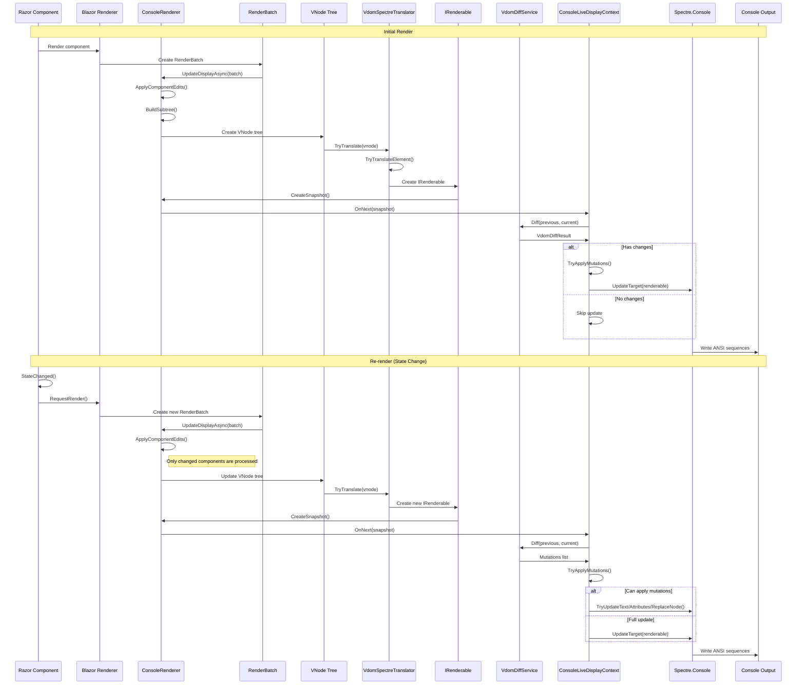
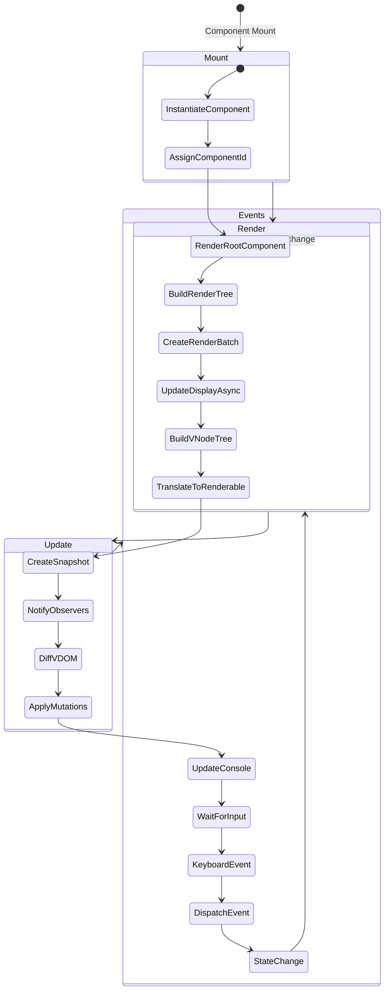
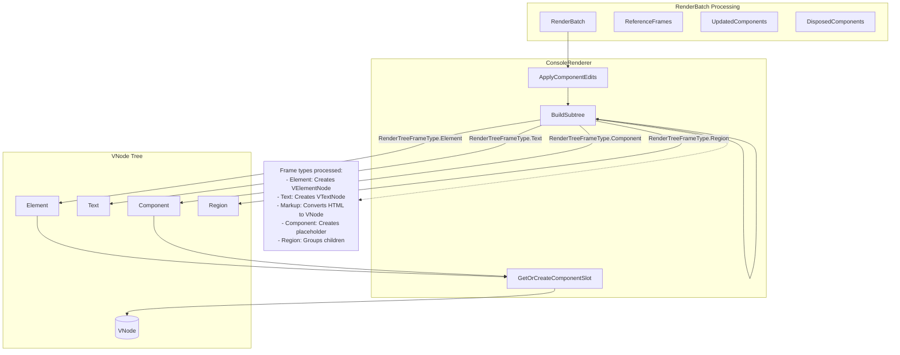
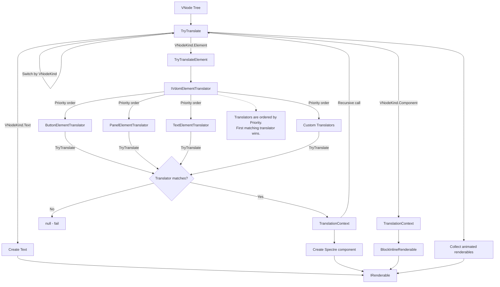
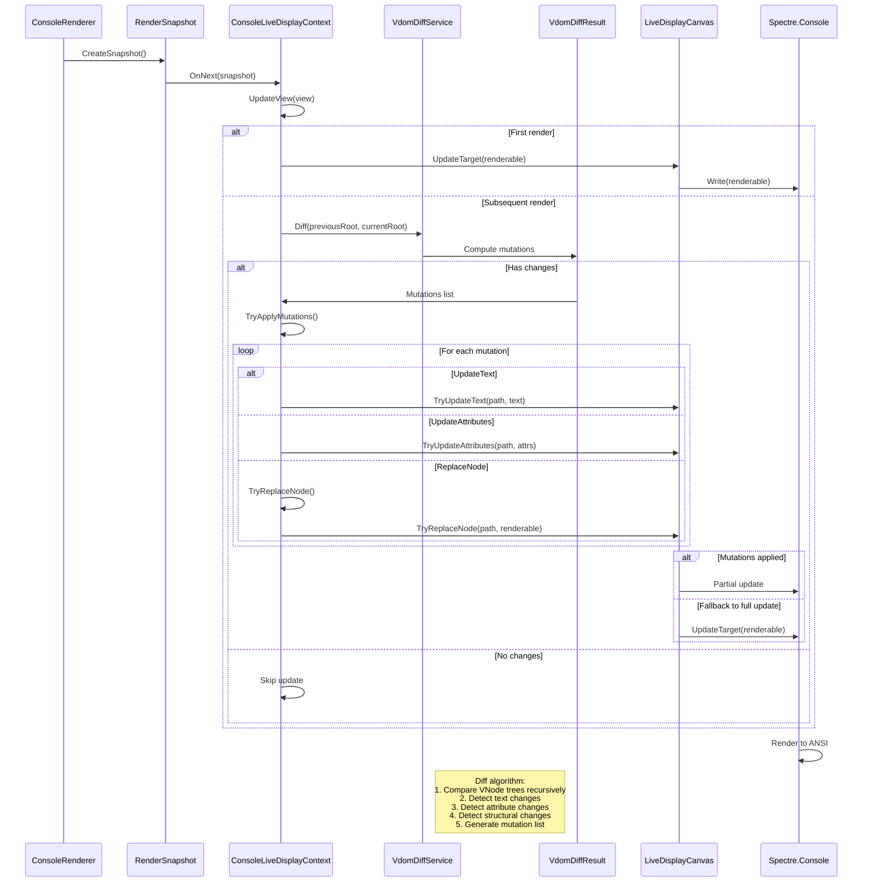
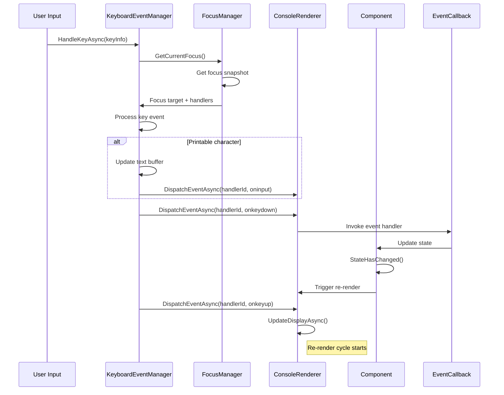

# Rendering Process

This document describes the complete rendering pipeline in RazorConsole, from Razor component to console output.

## Overview

RazorConsole uses a multi-stage rendering pipeline that converts Razor components into console output:

1. **Component Rendering**: Blazor renders Razor components into a `RenderBatch`
2. **VDOM Construction**: `ConsoleRenderer` converts `RenderBatch` into a `VNode` tree
3. **Translation**: `VdomSpectreTranslator` converts `VNode` tree into Spectre.Console `IRenderable`
4. **Diff & Update**: `VdomDiffService` computes differences for efficient updates
5. **Console Output**: Spectre.Console renders to ANSI escape sequences

## Complete Rendering Flow

## Component Lifecycle

## VDOM Construction Process

## Translation Process

## Diff and Update Process

## Event Handling and Re-render

