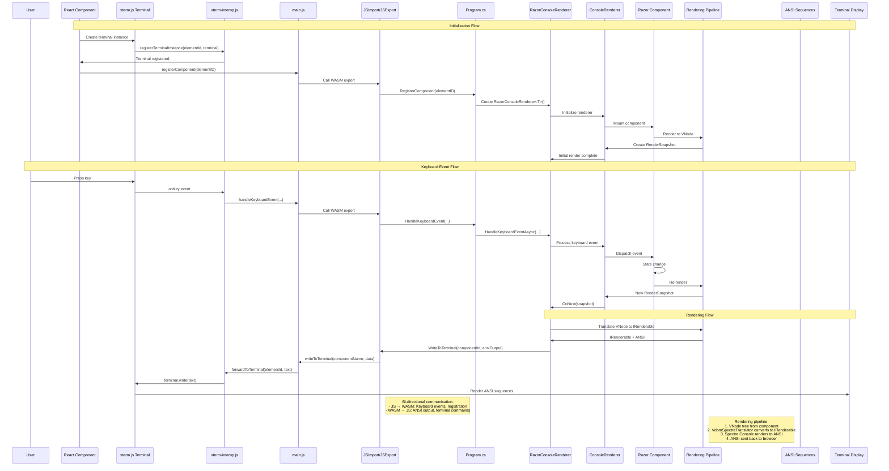
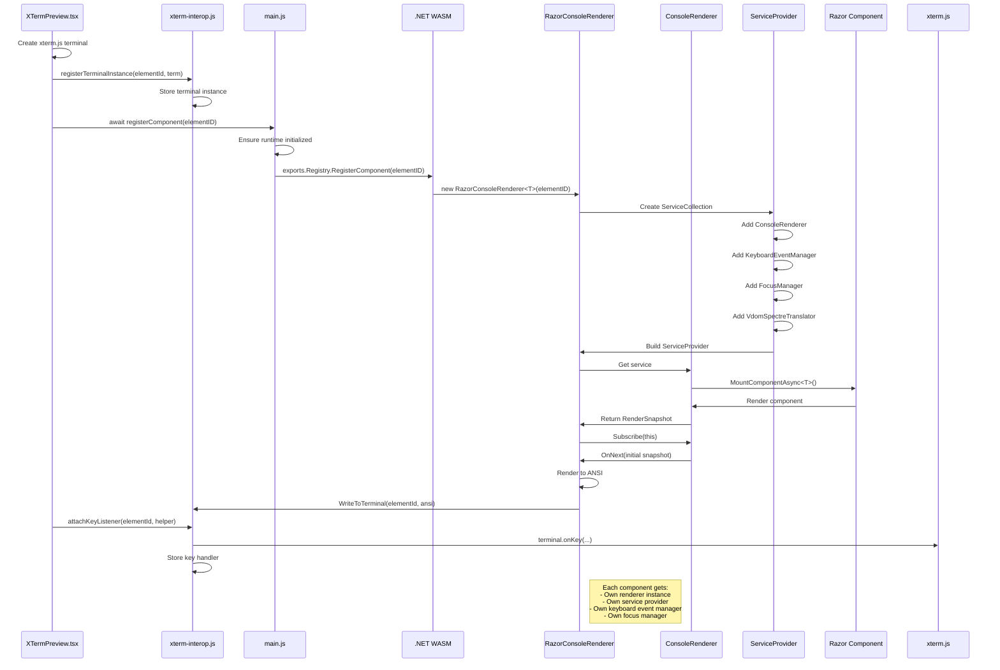
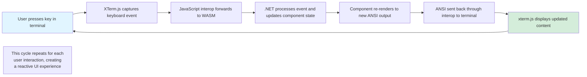

# How RazorConsole Components are Rendered in the Browser - JavaScript Interop with .NET WASM

The preview examples on the RazorConsole website are not pre-recorded videos or static images—they are fully interactive, real-time rendered components running directly in your browser. These live demonstrations are powered by the exact same RazorConsole rendering pipeline used in console applications, but executed via .NET WebAssembly (WASM) in the browser environment.

This document explains how the RazorConsole website delivers these live, interactive component demonstrations by integrating xterm.js terminals with .NET WASM components through JavaScript interop. The website showcases RazorConsole components (like TextInput, Select, Table, etc.) running in real-time within browser terminals, where users can interact with fully functional Razor components that render to ANSI output and respond to keyboard events just as they would in a native console application.

## Architecture Overview

RazorConsole uses a bi-directional JavaScript interop pattern where:

1. **Frontend (React/TypeScript)**: Creates and manages xterm.js terminal instances
2. **JavaScript Bridge**: Provides interop functions between browser and WASM
3. **.NET WASM Runtime**: Handles component rendering and keyboard events
4. **Rendering Pipeline**: Converts Razor components to ANSI escape sequences

## Complete Interop Flow



## Component Registration Sequence



## Event Loop Cycle



## Component Lifecycle Flow

### 1. Terminal Creation and Registration

The process begins when `XTermPreview.tsx` creates a new terminal instance:

```typescript
// XTermPreview.tsx - Terminal initialization
const term = new Terminal({
    fontFamily: "'Cascadia Code', 'Fira Code', Consolas, 'Courier New', monospace",
    fontSize: 14,
    theme: isDark ? TERMINAL_THEME.dark : TERMINAL_THEME.light,
    // ... other options
});

term.open(terminalRef.current);
registerTerminalInstance(elementId, term);
await registerComponent(elementId);
```

This calls into the JavaScript interop layer:

```javascript
// xterm-interop.js - Terminal registration
export function registerTerminalInstance(elementId, terminal) {
    terminalInstances.set(elementId, terminal);
}
```

### 2. Component Registration in WASM

The `registerComponent` call flows through `main.js` to the .NET WASM runtime:

```javascript
// main.js - Component registration bridge
export async function registerComponent(elementID) {
    if (exportsPromise === null) {
        // createRuntimeAndGetExports() sets up the .NET WASM runtime and returns 
        // exported functions/objects that can be called from JavaScript
        exportsPromise = createRuntimeAndGetExports();
    }
    const exports = await exportsPromise;
    return exports.Registry.RegisterComponent(elementID);
}
```

This triggers the .NET side component registration:

```csharp
// Program.cs - Registry.RegisterComponent
[JSExport]
public static void RegisterComponent(string elementID)
{
    switch (elementID)
    {
        case "Align":
            _renderers[elementID] = new RazorConsoleRenderer<Align_1>(elementID);
            break;
        // ... other component types
    }
}
```

### 3. Renderer Initialization

Each `RazorConsoleRenderer<T>` instance initializes its own rendering pipeline:

```csharp
// RazorConsoleRenderer.cs - Initialization
private async Task InitializeAsync()
{
    var services = new ServiceCollection();
    
    // Configure services for rendering
    services.TryAddSingleton<ConsoleRenderer>();
    services.TryAddSingleton<KeyboardEventManager>();
    services.TryAddSingleton<FocusManager>();
    
    _serviceProvider = services.BuildServiceProvider();
    _consoleRenderer = _serviceProvider.GetRequiredService<ConsoleRenderer>();
    _keyboardEventManager = _serviceProvider.GetRequiredService<KeyboardEventManager>();
    
    // Mount the component and start rendering
    var snapshot = await _consoleRenderer.MountComponentAsync<TComponent>(ParameterView.Empty, default);
    _consoleRenderer.Subscribe(this);
}
```

## Event Handling Flow

### 4. Keyboard Event Registration

After component registration, keyboard event listeners are attached:

```typescript
// XTermPreview.tsx - Event listener setup
attachKeyListener(elementId, {
    invokeMethodAsync: async (methodName: string, ...args: unknown[]) => {
        await handleKeyboardEvent(...(args as [string, string, string, boolean, boolean, boolean]))
        return null
    }
});
```

The JavaScript side sets up xterm.js event handlers:

```javascript
// xterm-interop.js - Keyboard event binding
export function attachKeyListener(elementId, helper) {
    const terminal = getExistingTerminal(elementId);
    keyHandlers.get(elementId)?.dispose();
    
    const subscription = terminal.onKey(event => {
        void helper.invokeMethodAsync('HandleKeyboardEvent', 
            elementId, 
            event.key,           // xterm key 
            event.domEvent.key,  // DOM key
            event.domEvent.ctrlKey, 
            event.domEvent.altKey, 
            event.domEvent.shiftKey
        );
    });
    
    keyHandlers.set(elementId, subscription);
}
```

### 5. Keyboard Event Processing

When a user presses a key in the terminal, the event flows through multiple layers:

```javascript
// main.js - Event forwarding to WASM
export async function handleKeyboardEvent(componentName, xtermKey, domKey, ctrlKey, altKey, shiftKey) {
    const exports = await exportsPromise;
    return exports.Registry.HandleKeyboardEvent(componentName, xtermKey, domKey, ctrlKey, altKey, shiftKey);
}
```

The .NET side processes the keyboard event:

```csharp
// Program.cs - Keyboard event handling
[JSExport]
public static async Task HandleKeyboardEvent(string elementID, string xtermKey, string domKey, bool ctrlKey, bool altKey, bool shiftKey)
{
    if (!_renderers.TryGetValue(elementID, out var renderer))
        return;
        
    await renderer.HandleKeyboardEventAsync(xtermKey, domKey, ctrlKey, altKey, shiftKey);
}
```

Key parsing and processing in the renderer:

```csharp
// RazorConsoleRenderer.cs - Key event processing
public async Task HandleKeyboardEventAsync(string xtermKey, string domKey, bool ctrlKey, bool altKey, bool shiftKey)
{
    var keyInfo = ParseKeyFromBrowser(xtermKey, domKey, ctrlKey, altKey, shiftKey);
    await _keyboardEventManager.HandleKeyAsync(keyInfo, CancellationToken.None);
}

private static ConsoleKeyInfo ParseKeyFromBrowser(string xtermKey, string domKey, bool ctrlKey, bool altKey, bool shiftKey)
{
    var consoleKey = domKey switch
    {
        "Enter" => ConsoleKey.Enter,
        "Tab" => ConsoleKey.Tab,
        "Backspace" => ConsoleKey.Backspace,
        "ArrowUp" => ConsoleKey.UpArrow,
        // ... other mappings
        _ when domKey.Length == 1 => ParseSingleChar(domKey[0]),
        _ => ConsoleKey.None
    };
    
    var keyChar = domKey switch
    {
        "Enter" => '\r',
        "Tab" => '\t',
        _ when xtermKey.Length == 1 => xtermKey[0],
        _ => '\0'
    };
    
    return new ConsoleKeyInfo(keyChar, consoleKey, shiftKey, altKey, ctrlKey);
}
```

## Rendering Pipeline

### 6. Component State Updates and Re-rendering

When keyboard events or other state changes occur, the rendering pipeline is triggered:

```csharp
// RazorConsoleRenderer.cs - Render observer
public void OnNext(ConsoleRenderer.RenderSnapshot value)
{
    try
    {
        var sw = new StringWriter();
        var console = AnsiConsole.Create(new AnsiConsoleSettings
        {
            Ansi = AnsiSupport.Yes,
            ColorSystem = ColorSystemSupport.Standard,
            Out = new AnsiConsoleOutput(sw)
        });

        var consoleOption = new RenderOptions(console.Profile.Capabilities, new Size(80, 150));
        var renderable = value.View.RootRenderable;
        console.Write(renderable);
        
        var ansiOutput = sw.ToString();
        
        // Send ANSI output back to JavaScript
        XTermInterop.WriteToTerminal(_componentId, ansiOutput);
        SnapshotRendered?.Invoke(ansiOutput);
    }
    catch (Exception ex)
    {
        // Error handling...
    }
}
```

### 7. ANSI Output Delivery

The rendered ANSI output is sent back to the JavaScript side:

```csharp
// Program.cs - XTermInterop partial class
[SupportedOSPlatform("browser")]
public partial class XTermInterop
{
    [JSImport("writeToTerminal", "main.js")]
    public static partial void WriteToTerminal(string componentName, string data);
}
```

The JavaScript side receives and displays the ANSI output:

```javascript
// main.js - Module imports setup
setModuleImports('main.js', {
    writeToTerminal: (componentName, data) => forwardToTerminal(componentName, data),
    // ... other imports
});

export async function writeToTerminal(componentName, data) {
    forwardToTerminal(componentName, data);
}
```

Final rendering in the terminal:

```javascript
// xterm-interop.js - Terminal output
export function writeToTerminal(elementId, text) {
    if (typeof text !== 'string' || text.length === 0) {
        return;
    }
    const terminal = getExistingTerminal(elementId);
    terminal.write(text);  // Display ANSI text in xterm.js
}
```

## Complete Event Loop

The complete interaction flow forms a cycle:

1. **User Input** → xterm.js captures keyboard event
2. **Event Forward** → JavaScript interop forwards to WASM
3. **State Update** → .NET processes event and updates component state
4. **Re-render** → Component re-renders to new ANSI output
5. **Output Display** → ANSI sent back through interop to terminal
6. **Visual Update** → xterm.js displays updated content

## Key Design Patterns

### Bi-directional Communication
- **JS → WASM**: Keyboard events, terminal lifecycle
- **WASM → JS**: ANSI output, terminal commands

### Asynchronous Operations
- Component registration and initialization are async
- Keyboard event handling is async to support complex state updates
- Rendering pipeline handles async component lifecycle

### Resource Management
- Terminal instances are tracked and disposed properly
- Event subscriptions are cleaned up to prevent memory leaks
- WASM components have proper lifecycle management

### Type Safety
- Strong typing between JavaScript and .NET through JSImport/JSExport
- Proper key event mapping between browser events and ConsoleKeyInfo
- ANSI output validation and error handling

This architecture enables RazorConsole to provide a seamless interactive terminal experience while maintaining the benefits of Razor component development patterns.